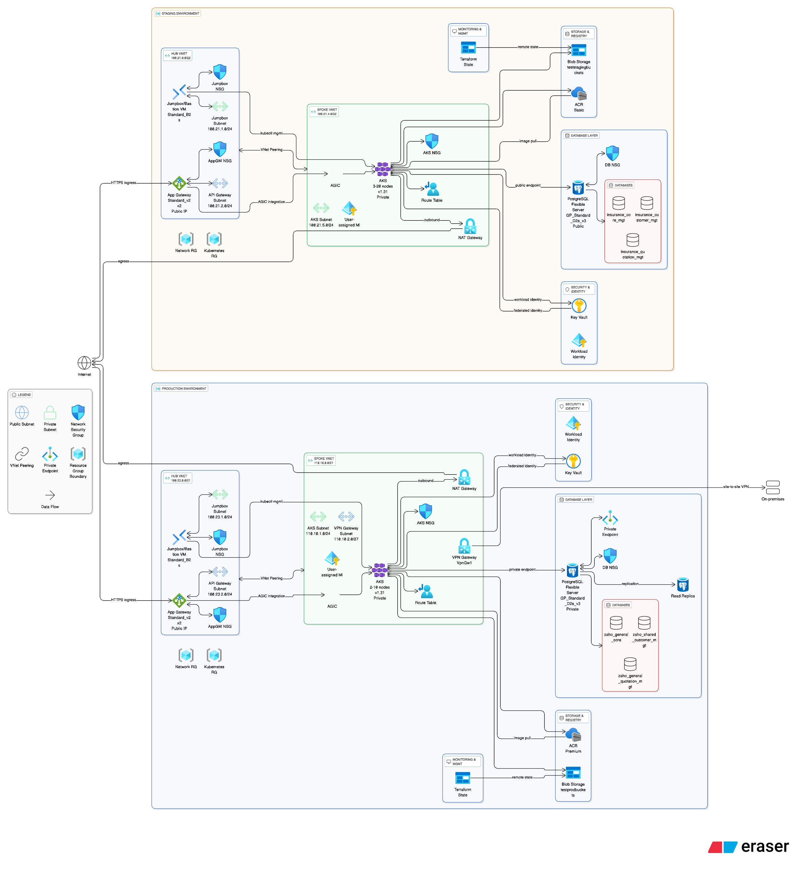

# Private AKS Terraform
Manage a "Fully" private AKS infrastructure with Terraform.

# Running the script
After you configure authentication with Azure, just init and apply (no inputs are required):

### STAGING ####
`terraform init -backend-config=environments/staging/staging.conf`
`terraform plan --var-file=environments/staging/staging.tfvars`
`terraform apply --var-file=environments/staging/staging.tfvars`

### PROD ####
`tf init --backend-config=environments/production/production.conf`
`terraform plan --var-file=environments/production/production.tfvars`
`terraform apply --var-file=environments/production/production.tfvars`

## Network Diagram

